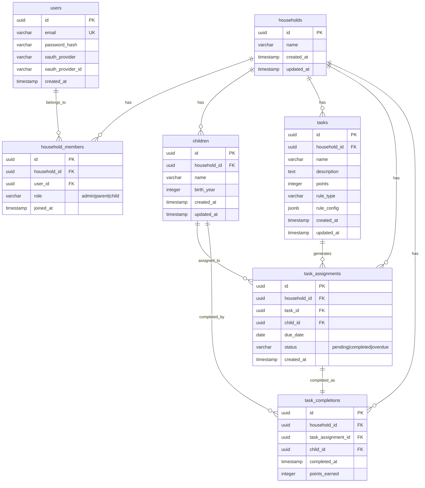

# Database Schema Documentation

**Last Updated**: 2025-12-14  
**Schema Version**: Migration 018  
**Database**: PostgreSQL 17

## Table of Contents
1. [Overview](#overview)
2. [Entity Relationship Diagram](#entity-relationship-diagram)
3. [Tables Reference](#tables-reference)
4. [Relationships](#relationships)
5. [Indexes](#indexes)
6. [Security](#security)
7. [Common Queries](#common-queries)
8. [Data Dictionary](#data-dictionary)
9. [Migration History](#migration-history)
10. [Developer Quick Start](#developer-quick-start)

---

## Overview

This database implements a **multi-tenant architecture** for a household chores management application called "Diddit". Each household is an isolated tenant, and all data is scoped to households to ensure complete data isolation between families.

### Key Architectural Principles

1. **Multi-Tenancy**: Every table with user data includes `household_id` for tenant isolation
2. **Defense-in-Depth Security**: Application filtering + Row-Level Security policies
3. **Performance**: Composite indexes optimize common query patterns
4. **Data Integrity**: Foreign key constraints with CASCADE deletes
5. **Scalability**: Designed to support 10,000+ households

### Data Flow

```
User → Login → Household Selection → Data Scoped to household_id
                                    ↓
                    All queries filtered by current household
                                    ↓
                        RLS enforces at database level
```

---

## Entity Relationship Diagram



---

## Tables Reference

### users
**Purpose**: Stores all user accounts (supports email/password and OAuth)

```sql
CREATE TABLE users (
  id UUID PRIMARY KEY DEFAULT gen_random_uuid(),
  email VARCHAR(255) UNIQUE NOT NULL,
  password_hash VARCHAR(255),              -- NULL for OAuth users
  oauth_provider VARCHAR(50),              -- 'google', 'microsoft', etc.
  oauth_provider_id VARCHAR(255),          -- User ID from OAuth provider
  created_at TIMESTAMP NOT NULL DEFAULT NOW()
);
```

**Key Points**:
- Email must be unique across all users
- `password_hash` is nullable for OAuth-only users
- OAuth users linked by email if account already exists
- Created in migration 001

---

### households
**Purpose**: Represents a household/family (primary tenant identifier)

```sql
CREATE TABLE households (
  id UUID PRIMARY KEY DEFAULT gen_random_uuid(),
  name VARCHAR(255) NOT NULL,
  created_at TIMESTAMP DEFAULT CURRENT_TIMESTAMP,
  updated_at TIMESTAMP DEFAULT CURRENT_TIMESTAMP
);
```

**Key Points**:
- Every household is an isolated tenant
- Name is the household's display name (e.g., "The Smith Family")
- Created in migration 011

---

### household_members
**Purpose**: Junction table linking users to households with roles

```sql
CREATE TABLE household_members (
  id UUID PRIMARY KEY DEFAULT gen_random_uuid(),
  household_id UUID NOT NULL REFERENCES households(id) ON DELETE CASCADE,
  user_id UUID NOT NULL REFERENCES users(id) ON DELETE CASCADE,
  role VARCHAR(50) NOT NULL CHECK (role IN ('admin', 'parent', 'child')),
  joined_at TIMESTAMP DEFAULT CURRENT_TIMESTAMP,
  UNIQUE(household_id, user_id)
);
```

**Key Points**:
- Users can belong to multiple households (separated parents)
- Roles: `admin` (full control), `parent` (manage children/tasks), `child` (view only)
- UNIQUE constraint: a user can only have one role per household
- Deleting household or user removes membership (CASCADE)
- Created in migration 012

---

### children
**Purpose**: Child profiles within households (for task assignment)

```sql
CREATE TABLE children (
  id UUID PRIMARY KEY DEFAULT gen_random_uuid(),
  household_id UUID NOT NULL REFERENCES households(id) ON DELETE CASCADE,
  name VARCHAR(255) NOT NULL,
  birth_year INTEGER,
  created_at TIMESTAMP DEFAULT CURRENT_TIMESTAMP,
  updated_at TIMESTAMP DEFAULT CURRENT_TIMESTAMP
);
```

**Key Points**:
- Each child belongs to exactly one household
- `birth_year` optional (for age-appropriate task assignment)
- Deleting household removes all children (CASCADE)
- Created in migration 013

---

### tasks
**Purpose**: Task templates/definitions within households

```sql
CREATE TABLE tasks (
  id UUID PRIMARY KEY DEFAULT gen_random_uuid(),
  household_id UUID NOT NULL REFERENCES households(id) ON DELETE CASCADE,
  name VARCHAR(255) NOT NULL,
  description TEXT,
  points INTEGER DEFAULT 10,
  rule_type VARCHAR(50) NOT NULL CHECK (rule_type IN ('weekly_rotation', 'repeating', 'daily')),
  rule_config JSONB,
  created_at TIMESTAMP DEFAULT CURRENT_TIMESTAMP,
  updated_at TIMESTAMP DEFAULT CURRENT_TIMESTAMP
);
```

**Key Points**:
- Tasks are templates that generate assignments
- `rule_type` determines assignment logic:
  - `weekly_rotation`: Rotates among children each week
  - `repeating`: Fixed schedule (e.g., every Monday)
  - `daily`: Assigned every day
- `rule_config` JSONB stores rule parameters (days of week, rotation order, etc.)
- Created in migration 014

---

### task_assignments
**Purpose**: Specific task instances assigned to children

```sql
CREATE TABLE task_assignments (
  id UUID PRIMARY KEY DEFAULT gen_random_uuid(),
  household_id UUID NOT NULL REFERENCES households(id) ON DELETE CASCADE,
  task_id UUID NOT NULL REFERENCES tasks(id) ON DELETE CASCADE,
  child_id UUID NOT NULL REFERENCES children(id) ON DELETE CASCADE,
  due_date DATE NOT NULL,
  status VARCHAR(50) DEFAULT 'pending' CHECK (status IN ('pending', 'completed', 'overdue')),
  created_at TIMESTAMP DEFAULT CURRENT_TIMESTAMP
);
```

**Key Points**:
- Represents a specific task to be done by a specific child on a specific date
- Status lifecycle: `pending` → `completed` or `overdue`
- Deleting task/child/household removes assignments (CASCADE)
- Created in migration 015

---

### task_completions
**Purpose**: Historical record of completed tasks

```sql
CREATE TABLE task_completions (
  id UUID PRIMARY KEY DEFAULT gen_random_uuid(),
  household_id UUID NOT NULL REFERENCES households(id) ON DELETE CASCADE,
  task_assignment_id UUID NOT NULL REFERENCES task_assignments(id) ON DELETE CASCADE,
  child_id UUID NOT NULL REFERENCES children(id) ON DELETE CASCADE,
  completed_at TIMESTAMP DEFAULT CURRENT_TIMESTAMP,
  points_earned INTEGER NOT NULL
);
```

**Key Points**:
- Immutable history of completed tasks
- Records points earned at completion time (may differ from current task.points)
- Used for statistics, leaderboards, historical analysis
- Created in migration 016

---

## Relationships

### Foreign Key Constraints

All foreign keys use `ON DELETE CASCADE` for automatic cleanup:

| From Table | Column | References | ON DELETE |
|------------|--------|------------|-----------|
| household_members | household_id | households(id) | CASCADE |
| household_members | user_id | users(id) | CASCADE |
| children | household_id | households(id) | CASCADE |
| tasks | household_id | households(id) | CASCADE |
| task_assignments | household_id | households(id) | CASCADE |
| task_assignments | task_id | tasks(id) | CASCADE |
| task_assignments | child_id | children(id) | CASCADE |
| task_completions | household_id | households(id) | CASCADE |
| task_completions | task_assignment_id | task_assignments(id) | CASCADE |
| task_completions | child_id | children(id) | CASCADE |

### CASCADE Behavior Examples

**Deleting a household**:
```sql
DELETE FROM households WHERE id = '<household-id>';
-- Automatically deletes:
-- - All household_members for that household
-- - All children in that household
-- - All tasks for that household
-- - All task_assignments for that household
-- - All task_completions for that household
```

**Deleting a child**:
```sql
DELETE FROM children WHERE id = '<child-id>';
-- Automatically deletes:
-- - All task_assignments for that child
-- - All task_completions for that child
```

**Deleting a task template**:
```sql
DELETE FROM tasks WHERE id = '<task-id>';
-- Automatically deletes:
-- - All task_assignments for that task
-- (But keeps task_completions - they have historical value)
```

---

## Indexes

### Performance Optimization Strategy

All indexes designed to optimize common query patterns with household_id filtering.

| Index Name | Table | Columns | Purpose |
|------------|-------|---------|---------|
| idx_household_members_household | household_members | (household_id) | List household members |
| idx_household_members_user | household_members | (user_id) | List user's households |
| idx_children_household | children | (household_id) | List household children |
| idx_children_household_name | children | (household_id, name) | Search children by name |
| idx_tasks_household | tasks | (household_id) | List household tasks |
| idx_task_assignments_household | task_assignments | (household_id) | List household assignments |
| idx_task_assignments_child | task_assignments | (child_id) | Child's task list |
| idx_task_assignments_due_date | task_assignments | (due_date) | Daily task queries |
| idx_task_assignments_child_due_status | task_assignments | (child_id, due_date, status) | Child's daily view (optimized) |
| idx_task_assignments_household_status_due | task_assignments | (household_id, status, due_date) | Household task management |
| idx_task_completions_household | task_completions | (household_id) | Household statistics |
| idx_task_completions_child | task_completions | (child_id) | Child's point history |
| idx_users_email | users | (email) UNIQUE | Login lookup |
| schema_migrations_pkey | schema_migrations | (version) | Migration tracking |

### Index Usage Examples

**Child's daily task view** (uses `idx_task_assignments_child_due_status`):
```sql
SELECT * FROM task_assignments
WHERE child_id = '<id>' AND due_date = CURRENT_DATE AND status = 'pending';
-- Index scan: child_id → due_date → status
```

**Household task management** (uses `idx_task_assignments_household_status_due`):
```sql
SELECT * FROM task_assignments
WHERE household_id = '<id>' AND status = 'pending' AND due_date BETWEEN '2025-12-14' AND '2025-12-20';
-- Index scan: household_id → status → due_date
```

---

## Security

### Row-Level Security (RLS)

All tenant-scoped tables have RLS enabled as defense-in-depth against SQL injection and application bugs.

**Enabled on**: households, household_members, children, tasks, task_assignments, task_completions

### Policy Enforcement

Application sets household context per request:
```sql
SET app.current_household_id = '<uuid>';
```

All queries automatically filtered to current household:
```sql
SELECT * FROM children;
-- Only returns children where household_id = current_setting('app.current_household_id')
```

### RLS Policies

Each table has an isolation policy:
```sql
CREATE POLICY households_isolation ON households
FOR ALL
USING (id = current_setting('app.current_household_id', TRUE)::UUID);

CREATE POLICY children_isolation ON children
FOR ALL
USING (household_id = current_setting('app.current_household_id', TRUE)::UUID);

-- Similar policies for all other tables
```

### Security Guarantees

- **Application enforces**: household_id filtering in all queries
- **Database enforces**: RLS policies prevent data leaks even if application is compromised
- **Even SQL injection cannot bypass RLS** when executing as non-superuser

### Testing RLS

Create test user (non-superuser):
```sql
CREATE ROLE app_user WITH LOGIN PASSWORD 'password';
GRANT USAGE ON SCHEMA public TO app_user;
GRANT SELECT, INSERT, UPDATE, DELETE ON ALL TABLES IN SCHEMA public TO app_user;
```

Test isolation:
```sql
-- As app_user
SET app.current_household_id = '<family-a-id>';
SELECT * FROM children; -- Only sees Family A children

SET app.current_household_id = '<family-b-id>';
SELECT * FROM children; -- Only sees Family B children
```

---

## Common Queries

### 1. User Authentication & Household Selection

**Get user by email** (login):
```sql
SELECT id, email, password_hash FROM users WHERE email = 'user@example.com';
-- Uses: idx_users_email (UNIQUE index)
```

**Get all households for a user**:
```sql
SELECT h.id, h.name, hm.role
FROM households h
JOIN household_members hm ON h.id = hm.household_id
WHERE hm.user_id = '<user-id>'
ORDER BY hm.joined_at DESC;
-- Uses: idx_household_members_user
```

**Set household context** (for RLS):
```sql
SET app.current_household_id = '<household-id>';
```

---

### 2. Household Management

**Get all children in household**:
```sql
SELECT id, name, birth_year, created_at
FROM children
WHERE household_id = '<household-id>'
ORDER BY name;
-- Uses: idx_children_household
```

**Search children by name**:
```sql
SELECT * FROM children
WHERE household_id = '<household-id>' AND name ILIKE '%Emma%';
-- Uses: idx_children_household_name
```

**Get household members with user details**:
```sql
SELECT u.email, hm.role, hm.joined_at
FROM household_members hm
JOIN users u ON hm.user_id = u.id
WHERE hm.household_id = '<household-id>'
ORDER BY hm.role, u.email;
-- Uses: idx_household_members_household
```

---

### 3. Task Management

**Get all task templates for household**:
```sql
SELECT id, name, description, points, rule_type
FROM tasks
WHERE household_id = '<household-id>'
ORDER BY name;
-- Uses: idx_tasks_household
```

**Create new task assignment**:
```sql
INSERT INTO task_assignments (household_id, task_id, child_id, due_date, status)
VALUES ('<household-id>', '<task-id>', '<child-id>', '2025-12-15', 'pending')
RETURNING *;
```

---

### 4. Daily Task Views

**Child's tasks for today**:
```sql
SELECT 
  ta.id as assignment_id,
  t.name,
  t.description,
  t.points,
  ta.status,
  ta.due_date
FROM task_assignments ta
JOIN tasks t ON ta.task_id = t.id
WHERE ta.child_id = '<child-id>'
  AND ta.due_date = CURRENT_DATE
ORDER BY t.name;
-- Uses: idx_task_assignments_child_due_status (optimized composite index)
```

**Household's pending tasks for this week**:
```sql
SELECT 
  ta.id,
  c.name as child_name,
  t.name as task_name,
  ta.due_date,
  ta.status
FROM task_assignments ta
JOIN children c ON ta.child_id = c.id
JOIN tasks t ON ta.task_id = t.id
WHERE ta.household_id = '<household-id>'
  AND ta.status = 'pending'
  AND ta.due_date BETWEEN CURRENT_DATE AND CURRENT_DATE + INTERVAL '7 days'
ORDER BY ta.due_date, c.name;
-- Uses: idx_task_assignments_household_status_due
```

---

### 5. Task Completion

**Mark task as complete**:
```sql
BEGIN;

-- Create completion record
INSERT INTO task_completions (household_id, task_assignment_id, child_id, points_earned)
SELECT household_id, id, child_id, 
       (SELECT points FROM tasks WHERE id = task_id)
FROM task_assignments
WHERE id = '<assignment-id>'
RETURNING *;

-- Update assignment status
UPDATE task_assignments
SET status = 'completed'
WHERE id = '<assignment-id>';

COMMIT;
```

---

### 6. Statistics & Reporting

**Child's total points**:
```sql
SELECT SUM(points_earned) as total_points
FROM task_completions
WHERE child_id = '<child-id>';
-- Uses: idx_task_completions_child
```

**Child's completion rate this week**:
```sql
SELECT 
  COUNT(*) FILTER (WHERE status = 'completed') as completed,
  COUNT(*) FILTER (WHERE status = 'pending') as pending,
  COUNT(*) FILTER (WHERE status = 'overdue') as overdue,
  COUNT(*) FILTER (WHERE status = 'completed') * 100.0 / COUNT(*) as completion_rate
FROM task_assignments
WHERE child_id = '<child-id>'
  AND due_date >= CURRENT_DATE - INTERVAL '7 days'
  AND due_date <= CURRENT_DATE;
```

**Household leaderboard** (top children by points this month):
```sql
SELECT 
  c.name,
  COUNT(tc.id) as tasks_completed,
  SUM(tc.points_earned) as total_points
FROM children c
JOIN task_completions tc ON c.id = tc.child_id
WHERE c.household_id = '<household-id>'
  AND tc.completed_at >= DATE_TRUNC('month', CURRENT_DATE)
GROUP BY c.id, c.name
ORDER BY total_points DESC;
-- Uses: idx_task_completions_child, idx_children_household
```

---

### 7. Overdue Task Detection

**Mark overdue tasks** (run daily):
```sql
UPDATE task_assignments
SET status = 'overdue'
WHERE status = 'pending'
  AND due_date < CURRENT_DATE;
```

**Get all overdue tasks for household**:
```sql
SELECT 
  c.name as child_name,
  t.name as task_name,
  ta.due_date,
  CURRENT_DATE - ta.due_date as days_overdue
FROM task_assignments ta
JOIN children c ON ta.child_id = c.id
JOIN tasks t ON ta.task_id = t.id
WHERE ta.household_id = '<household-id>'
  AND ta.status = 'overdue'
ORDER BY ta.due_date;
```

---

## Data Dictionary

### households

| Column | Type | Nullable | Default | Description |
|--------|------|----------|---------|-------------|
| id | UUID | NO | gen_random_uuid() | Primary key |
| name | VARCHAR(255) | NO | - | Household display name |
| created_at | TIMESTAMP | NO | CURRENT_TIMESTAMP | Creation timestamp |
| updated_at | TIMESTAMP | NO | CURRENT_TIMESTAMP | Last update timestamp |

---

### users

| Column | Type | Nullable | Default | Description |
|--------|------|----------|---------|-------------|
| id | UUID | NO | gen_random_uuid() | Primary key |
| email | VARCHAR(255) | NO | - | User email (unique, used for login) |
| password_hash | VARCHAR(255) | YES | - | Bcrypt password hash (NULL for OAuth users) |
| oauth_provider | VARCHAR(50) | YES | - | OAuth provider name ('google', etc.) |
| oauth_provider_id | VARCHAR(255) | YES | - | User ID from OAuth provider |
| created_at | TIMESTAMP | NO | NOW() | Account creation timestamp |

---

### household_members

| Column | Type | Nullable | Default | Description |
|--------|------|----------|---------|-------------|
| id | UUID | NO | gen_random_uuid() | Primary key |
| household_id | UUID | NO | - | Foreign key to households |
| user_id | UUID | NO | - | Foreign key to users |
| role | VARCHAR(50) | NO | - | Role: 'admin', 'parent', or 'child' |
| joined_at | TIMESTAMP | NO | CURRENT_TIMESTAMP | Membership creation timestamp |

**Constraints**:
- UNIQUE(household_id, user_id) - User can only have one role per household
- CHECK: role IN ('admin', 'parent', 'child')

---

### children

| Column | Type | Nullable | Default | Description |
|--------|------|----------|---------|-------------|
| id | UUID | NO | gen_random_uuid() | Primary key |
| household_id | UUID | NO | - | Foreign key to households |
| name | VARCHAR(255) | NO | - | Child's name |
| birth_year | INTEGER | YES | - | Birth year (for age-appropriate tasks) |
| created_at | TIMESTAMP | NO | CURRENT_TIMESTAMP | Creation timestamp |
| updated_at | TIMESTAMP | NO | CURRENT_TIMESTAMP | Last update timestamp |

---

### tasks

| Column | Type | Nullable | Default | Description |
|--------|------|----------|---------|-------------|
| id | UUID | NO | gen_random_uuid() | Primary key |
| household_id | UUID | NO | - | Foreign key to households |
| name | VARCHAR(255) | NO | - | Task name/title |
| description | TEXT | YES | - | Detailed task description |
| points | INTEGER | NO | 10 | Points awarded for completion |
| rule_type | VARCHAR(50) | NO | - | Assignment rule: 'weekly_rotation', 'repeating', 'daily' |
| rule_config | JSONB | YES | - | Rule parameters (JSON) |
| created_at | TIMESTAMP | NO | CURRENT_TIMESTAMP | Creation timestamp |
| updated_at | TIMESTAMP | NO | CURRENT_TIMESTAMP | Last update timestamp |

**Constraints**:
- CHECK: rule_type IN ('weekly_rotation', 'repeating', 'daily')

---

### task_assignments

| Column | Type | Nullable | Default | Description |
|--------|------|----------|---------|-------------|
| id | UUID | NO | gen_random_uuid() | Primary key |
| household_id | UUID | NO | - | Foreign key to households |
| task_id | UUID | NO | - | Foreign key to tasks |
| child_id | UUID | NO | - | Foreign key to children |
| due_date | DATE | NO | - | Date task is due |
| status | VARCHAR(50) | NO | 'pending' | Status: 'pending', 'completed', 'overdue' |
| created_at | TIMESTAMP | NO | CURRENT_TIMESTAMP | Assignment creation timestamp |

**Constraints**:
- CHECK: status IN ('pending', 'completed', 'overdue')

---

### task_completions

| Column | Type | Nullable | Default | Description |
|--------|------|----------|---------|-------------|
| id | UUID | NO | gen_random_uuid() | Primary key |
| household_id | UUID | NO | - | Foreign key to households |
| task_assignment_id | UUID | NO | - | Foreign key to task_assignments |
| child_id | UUID | NO | - | Foreign key to children |
| completed_at | TIMESTAMP | NO | CURRENT_TIMESTAMP | Completion timestamp |
| points_earned | INTEGER | NO | - | Points earned (snapshot at completion) |

---

## Migration History

| Version | Name | Description | Date |
|---------|------|-------------|------|
| 000 | create_migrations_table | Schema migrations tracking table | 2025-12-13 |
| 001 | create_users_table | Users table with OAuth support | 2025-12-13 |
| 011 | create_households_table | Households (tenant) table | 2025-12-14 |
| 012 | create_household_members_table | User-household junction with roles | 2025-12-14 |
| 013 | create_children_table | Children profiles | 2025-12-14 |
| 014 | create_tasks_table | Task templates | 2025-12-14 |
| 015 | create_task_assignments_table | Task instances | 2025-12-14 |
| 016 | create_task_completions_table | Completion history | 2025-12-14 |
| 017 | add_performance_indexes | Composite indexes for optimization | 2025-12-14 |
| 018 | implement_row_level_security | RLS policies for data isolation | 2025-12-14 |

**Migration Files**: `docker/postgres/migrations/NNN_name.sql`  
**Documentation**: `docker/postgres/migrations/README.md`

---

## Developer Quick Start

### Setting Household Context

**Every database operation MUST set household context first**:

```javascript
// Backend: Fastify preHandler hook
async function setHouseholdContext(request, reply) {
  const householdId = request.user.currentHouseholdId; // From auth token
  await db.query('SET app.current_household_id = $1', [householdId]);
}

// Register on all routes
fastify.addHook('preHandler', setHouseholdContext);
```

### Safe Query Patterns

**Always include household_id** in queries (even though RLS enforces it):

```javascript
// ✅ GOOD: Explicit household_id filtering
const children = await db.query(
  'SELECT * FROM children WHERE household_id = $1',
  [householdId]
);

// ❌ BAD: Relies only on RLS (less explicit, harder to debug)
const children = await db.query('SELECT * FROM children');
```

### Testing Queries

Use `EXPLAIN ANALYZE` to verify index usage:

```sql
EXPLAIN ANALYZE
SELECT * FROM task_assignments
WHERE child_id = '<id>' AND due_date = CURRENT_DATE AND status = 'pending';

-- Look for: "Index Scan using idx_task_assignments_child_due_status"
-- Avoid: "Seq Scan" (sequential scan = no index used)
```

### Common Pitfalls

1. **Forgetting to set household context** → RLS throws error
2. **Using SELECT * in production** → Performance issues, wasted bandwidth
3. **Not using indexes** → Check EXPLAIN plans
4. **Hardcoding household_id in SQL** → Use parameterized queries

### Performance Guidelines

- Target: All queries < 50ms
- Use composite indexes for multi-column WHERE clauses
- Limit results with LIMIT when appropriate
- Use COUNT(*) FILTER instead of multiple queries

---

## Additional Resources

- **Migration System**: [migrations/README.md](migrations/README.md)
- **Project README**: [../../README.md](../../README.md)
- **API Documentation**: Coming soon
- **Testing Guide**: [../../docs/E2E_TESTING.md](../../docs/E2E_TESTING.md)

---

**Questions or Issues?**  
Contact: Project maintainers  
Last Review: 2025-12-14
