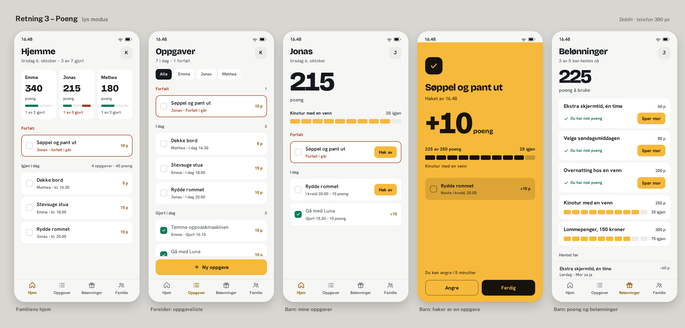

# Design System: Diddit

## The signed-off picture is the spec

`reference/poeng-signed-off.png` — "Retning 3 – Poeng · lys modus", five screens, phones at 390 px.
Signed off by Stig (owner). Source of record: ST-744.

**Everything in this guide describes that picture.** The picture outranks the guide. If a rule here
would remove, tone down, or ration something the picture visibly does, the rule is wrong — delete the
rule, keep the picture. Check your work against the picture first and against this text second.

This is not a hypothetical failure mode. On ST-729 a style guide was written whose rules were
_stricter_ than the picture ("yellow only as a surface", "one yellow area per screen", "the tick
moment goes dark"). The screens built from those rules had the yellow drained out of them, every
review passed because every review checked the rules, and Stig rejected the result. See
**Banned rules** at the end of this file.

## Overview

**Creative North Star: "The Reward Is The Interface"**

Diddit is a family chore app, in Norwegian, light mode. The product promise is that a child earns
points and can see them. So the points are literally the largest thing on the screen: an 83 px black
numeral on a child's own screen, 94 px in the moment a chore is ticked off. Nothing else on the
screen competes with it. Everything around it is small, quiet and ordinary — plain white cards on a
near-white background, a 16 px row title, a 13 px line of context underneath.

The yellow is the second voice, and it is a loud one. It is not an accent reserved for one special
button; it fills primary buttons, every per-item action button, every points meter, and the entire
background of the screen where a chore gets ticked off. On the rewards screen it appears five times.
The system's warmth comes from using it freely; the discipline is in the _text colour on top of it_
(always near-black ink), not in rationing the yellow itself.

Depth is tonal, not shadowed. A white card on a near-white screen is the only layering device on the
light screens; on the yellow screen, depth is a _darker shade of the same yellow_. There are no drop
shadows and no card borders anywhere in the picture.

**Key Characteristics:**

- Points are the hero: one enormous tabular numeral per child screen, never a second hero near it.
- Yellow is used freely and is always one hex (`#F6B93B`), never lightened, muted or greyed.
- Near-black ink on yellow, always (10.57:1). White on yellow never appears.
- Flat: no shadows, no card strokes. Strokes exist, but only for state, a control boundary, or a
  structural divider — never decoration.
- Every state that uses colour also uses a word: "Forfalt", "Gjort 16.10", "35 igjen".
- Light mode only. The picture is "lys modus" and there is no signed-off dark mode.

## Measurement basis

Everything below is CSS px at **390 × 844**, the viewport the picture's own "telefon 390 px" caption
describes.

The reference board is 4260 × 2044 px and holds five phone frames, each **780 × 1688 board px**
(frames start at x = 88, 924, 1760, 2596, 3432; content runs y = 194…1881; gutters are 56 board px).
780 ÷ 390 = **exactly 2 board px per CSS px**, and 1688 ÷ 2 = 844, the standard 390 × 844 logical
viewport. So the board is five device-true screens rendered at `deviceScaleFactor: 2`.

> **Correction, 2026-10-07.** The first version of this guide assumed 1.846 board px per CSS px,
> from reading the phone frame as 720 px wide rather than 780. Every CSS px value in it was ~8% too
> large, and the screen gutter and card width were wrong outright because screen 1's three
> side-by-side child cards were read as one full-width card. All sizes below were re-measured.
> If you have a copy of the earlier numbers, discard them.

> **Correction, 2026-10-09 (ST-756).** Redrawing the five screens against the picture (ST-740)
> proved ten more lines of this guide wrong, and they are corrected below. Six were wrong
> independently of which font the picture used — they are ratios and geometry _inside_ the picture:
> Display was 100 px and is **94 px**; "Display sm" covered both «215» and «225» at one size and is
> now **two** sizes, 83 px and 59 px; the word «poeng» beside «+10» had no size and is **23 px**;
> the 22 px gutter is right on screens 1, 2, 3 and 5 but the tick screen runs a **24 px** gutter and
> a **342 px** column; the bottom nav is pitched at **92 px**, not four equal quarters of 390; and
> the **initial badge** was missing from the guide entirely. Four were font-dependent sizes that
> render 20–25 % too large with the two font names this guide guesses at — Body, in-card text, and
> both button labels. Measurements and the side-by-side renders live on task ST-740
> (`screens-v2`); the corrections were made on ST-756 and Maria approved every one of them.

## Colors

A single warm yellow against warm-neutral greys, with three small semantic colours that only appear
where they carry meaning.

### Primary

- **Diddit Yellow** (`#F6B93B`): the one yellow. Primary buttons, per-row action buttons ("Hak av"),
  per-reward buttons ("Spør mor"), filled points-meter segments, and the full-bleed background of
  the tick-off moment. It is a surface colour and a fill colour, not a text colour: at 1.76:1
  against white it must never carry type or a hairline on its own.

### Secondary

- **Ink** (`#17120A`): the near-black that lives _on_ the yellow — all text, icons, meter fills,
  the tick badge, and the solid "Ferdig" button on the yellow screen. 10.57:1 on the yellow.
- **Amber Ink** (`#8A5A00`): the small amber type — points values on a chore row ("5 p") and the
  active bottom-nav label. 5.93:1 on white. It reads as "this is about points" without adding a
  second yellow surface. It is a _white-background_ colour: on the yellow it is only 3.36:1 and
  must not be used for text there.

### Tertiary

- **Overdue Rust** (`#A43A16`): the "Forfalt" word, the 2 px border on an overdue card, the
  "1 av 3 gjort" line on a child card that is behind, **and that card's overdue meter segment**.
  6.57:1 on white.
- **Done Green** (`#0F7A54`): the filled checkmark on a completed chore, "Du har nok poeng" on an
  affordable reward, **and the filled segments of the chore meter on a family card**. 5.34:1 on
  white; white tick on the green is the same 5.34:1.

### Neutral

- **Text** (`#15181C`): headings, screen titles, the big point numerals on white, and the fill of
  an active filter chip.
- **Muted Text** (`#555E64`): dates, "Mathea – kl. 16.30", inactive nav labels, and the points value
  on a reward card ("60 p"). 6.62:1 on white.
- **Surface** (`#FFFFFF`): cards.
- **Background** (`#F6F6F4`): the screen behind the cards, and the bottom nav band — the nav is not
  a separate white bar.
- **Track** (`#ECECE8`): the unfilled segments of a meter on a white screen.
- **Hairline** (`#DFDFD9`): the structural dividers (above the bottom nav, under "Hentet før") and
  the resting outline of an unchecked checkbox. See **Elevation & Depth** for what it may and may
  not be used for.

### On-yellow neutrals

The yellow screen does not borrow greys. Its two surfaces are darker shades of the same hue:

- **Yellow Inset** (`#DBA434`): the inset card on the yellow screen (the "next chore" block).
  Ink on it is still 8.31:1.
- **Yellow Track** (`#C59430`): unfilled meter segments on the yellow screen, against ink fills
  at 6.79:1.

### Named Rules

**The Keep-The-Yellow Rule.** When contrast fails on or around the yellow, you change the _other_
side: text colour, weight, size, or a darker shade of the same hue on a small area. You never
desaturate, lighten, grey out, or replace the yellow, and you never swap a yellow surface for a
neutral one to pass a check. Black on yellow is the system's answer; it already passes AAA.

**The Ink-On-Yellow Rule.** Anything sitting on `#F6B93B` is `#17120A`. White text on the yellow
(1.76:1) does not exist in this system at any size.

**The Say-It-In-Words Rule.** No state is carried by colour alone. Overdue is red _and_ the word
"Forfalt". Done is green _and_ a timestamp. A meter always has its number beside it ("35 igjen",
"225 av 250 poeng"). This is what keeps a 1.49:1 filled-vs-empty meter conformant and legible.

## Typography

**Display Font:** Bricolage Grotesque (fallback `system-ui, sans-serif`) — weight 800 only.
**Body Font:** Hanken Grotesk (fallback `system-ui, sans-serif`) — weights 500 and 600.

> **These two names are the best available match, not a documented fact.** Both faces ship with the
> earlier Diddit design sources and their ink heights fit the picture well, but their ink widths do
> not fit as cleanly. If you set type from these names and it runs wide, that is why — try tracking
> before you change a size, and confirm the faces against the source HTML if it turns up.
>
> Two consequences, both load-bearing:
>
> 1. **The display numerals need −0.04em with _this_ font, where the token says −0.02em.** Bricolage
>    at normal width renders «215» 8 % too wide and its condensed instance 12 % too narrow; at
>    −0.04em the ink lands on the picture's 136.0 px. The token keeps −0.02em because that is a
>    property of the look, not of the picture's pixels; −0.04em is the correction Bricolage needs to
>    stand in for a face we have not identified. If the real face turns up, this goes away.
> 2. **Four text sizes were fitted _to_ this font and move if the font changes** — Button label,
>    Body, Meta and Meta sm. They were derived from ink width, not ink height, because that is the
>    only thing the picture pins down for text this small. The display and Number sizes came from
>    ink height and are far less font-dependent. See the re-derivation note after the table.
>
> After that fitting, what is left is residual and uncorrected: chore-row titles render 3.7 % wide
> (83.0 vs 80.0 px ink), chore-row meta 4 % narrow (110.5 vs 115.0), screen 4's title 2.5 % narrow.
> Full detail in [RULE-CHECK.md](RULE-CHECK.md#unverified-in-this-pass).

**Character:** A tight, heavy grotesque for every number and screen title, and a calm humanist
grotesque for everything a person reads as a sentence. The pairing does the hierarchy on its own:
there is no third font, no italic, and no uppercase tracking anywhere in the picture.

### Hierarchy

Every size was derived from one string in the picture, and the string is named so you can re-check
it. **Three different methods, and it matters which one you re-run:**

- **Display sizes — ratio against "215".** «215» is the anchor at 83 px. The other three are fixed
  by the ratio of their ink to its ink: that is a measurement _inside_ the picture and it does not
  depend on which font the picture used. Re-derive them this way, not from a font's em ratio.
- **Number, Title, Label, Caption — ink height ÷ the font's ink-height-per-em**, read from the font
  file. These are unchanged from the first pass and still check out.
- **Text sizes — ink width.** The size at which the string's drawn width reproduces the picture's.
  Ink height is too coarse at these sizes: a 1 board px threshold error is 3.5 % of a 29 px
  measurement, which is how "Body 20 px" survived a pass.

| Style            | Size   | Measured from                          | Measured ink in the picture          |
| ---------------- | ------ | -------------------------------------- | ------------------------------------ |
| **Display**      | 94px   | "+10", screen 4                        | 66.5 px high → 1.137 × «215»         |
| **Display sm**   | 83px   | "215", screen 3                        | 58.5 px high, 136.0 px wide — anchor |
| **Display xs**   | 59px   | "225", screen 5                        | 41.5 px high → 0.709 × «215»         |
| **Display unit** | 23px   | "poeng" beside "+10", screen 4         | 60 px wide                           |
| **Number**       | 30px   | "340" on a family card, screen 1       | 41 board px high                     |
| **Title**        | 27px   | "Oppgaver", screen 2                   | 46 board px high                     |
| **Button label** | 16.5px | "+ Ny oppgave" primary label, screen 2 | 105.5 px wide                        |
| **Body**         | 16px   | "Dekke bord" chore title, screen 2     | 80.0 px wide                         |
| **Meta**         | 15px   | "Haket av 16.48", screen 4             | 98.0 px wide                         |
| **Meta sm**      | 13px   | "Mathea – I dag 16.30" in a card, s. 2 | 115.0 px wide                        |
| **Label**        | 13px   | "Forfalt" group label, screen 2        | 18 board px high                     |
| **Caption**      | 12px   | bottom-nav labels, screen 1            | 22 board px high                     |

> **Do not re-derive the display sizes from Bricolage's em ratio, and know where the uncertainty
> sits.** Running «+10» through the font file's own 0.687 returns 97 px where the picture's ratio
> against «215» returns 94 px. The whole 3 px hangs on one measurement: «215» ink reads **117 board
> px** at the threshold ST-740 used and 115 at the threshold revision 3 used, and the anchor is
> 83 px either way. 94 is the value that **reproduced the picture in a render measured against the
> board**, which is the stronger evidence, and it is the approved value. Treat Display, Display xs
> and Display unit as **±1 px** and leave them alone unless you are re-measuring from a render, not
> from a font file. The three ratio-derived sizes are internally consistent at 0.703–0.707 ink
> height per em against Bricolage's own 0.687–0.691 — a 2 % gap in the same direction as the text
> sizes, from the same cause: the face is a guess.

- **Display** (Bricolage 800, 0.95, −0.02em, tabular): the points won in the tick-off moment.
  The single largest thing in the product.
- **Display sm** (Bricolage 800, 0.95, −0.02em, tabular): a child's total on their own chore
  screen — "215". One per screen, top-left, with the word "poeng" under it.
- **Display xs** (Bricolage 800, 0.95, −0.02em, tabular): the balance at the top of the rewards
  screen — "225". **The picture does not set this at the same size as "215".** «215» ink is 58.5 px
  tall and «225» is 41.5 px, a ratio of 0.71, and their widths agree (136.0 vs 99.5 px). Still the
  one hero of its screen, just a smaller one — a balance you are about to spend, not a score.
- **Display unit** (Bricolage 800, 1.0): the word "poeng" sitting on the baseline beside "+10" on
  the tick screen. Not Body — it is display type, a third the height of the numeral it follows.
- **Number** (Bricolage 800, 1.0, tabular): a child's total on a family card — "340".
- **Title** (Bricolage 800, 1.15): the screen name — "Hjemme", "Oppgaver", "Belønninger".
- **Button label** (Hanken 600, 1.35): the full-width primary button only — 16.5 px, half a pixel
  above Body, which is what makes the label ink land on 105.5 px inside a 346 px button.
- **Body** (Hanken 600, 1.35): chore titles, reward titles, history-row titles, and the labels on
  row-level action buttons ("Hak av", "Spør mor") at **16 px** — the width the picture's own
  70 px and 87 px buttons require.
- **Meta** (Hanken 500, 1.4): the line _outside_ a card — a screen's sub-line, the word "poeng"
  under a hero number, a person's name ("Emma" on a child card), and "Haket av 16.48".
- **Meta sm** (Hanken 500, 1.4): the same voice **inside** a card, one step down at 13 px — the
  who-and-when line ("Mathea – I dag 16.30"), "Du har nok poeng", "1 av 2 gjort", "5 p", "60 p",
  "25 igjen". A card's second line is quieter than a screen's second line; that is the picture.
- **Label** (Hanken 600, 1.3): group labels — "Forfalt", "I dag", "Gjort i dag", "Hentet før".
- **Caption** (Hanken 600, 1.3): bottom-nav labels.

Note that **Label is smaller than Meta** in this picture: the group headings are quieter than the
row text they introduce. That is deliberate in the reference; do not "fix" it by swapping them.

> **Re-derive the text sizes if the real source font turns up.** Button label, Body, Meta and
> Meta sm — and only those four — were fitted by ink _width_ against Hanken Grotesk, which this
> guide names as a guess (see the caveat above). A different face of the same ink height will want
> different numbers. The display sizes were fitted by ink _height_ and move far less, but re-check
> them too. The ink measurements in the right-hand column are the picture's and do not change; the
> px sizes in the left-hand column are the ones to re-compute.

### Named Rules

**The Tabular Numbers Rule.** Every number uses `font-variant-numeric: tabular-nums`. Points change
while a child is looking at them; proportional figures make the total jiggle as it counts. This is
measurable in the picture: "215" is 7.7% wider than proportional figures of the same height would
be, which is the tabular `1`.

**The One Hero Rule.** A screen has exactly one number in Display, Display sm or Display xs. The
tick-off moment has "+10" and nothing else that size; the chore screen has "215" and the rewards
screen has "225", each with nothing else that size. The hero sizes differ between screens — that is
the picture — but a screen never carries two of them.

## Layout

A 390 × 844 phone, single column, content scrolling between a fixed title area and a fixed bottom nav.

- **Screen gutter: 22 px**, giving a **346 px content column**, on screens 1, 2, 3 and 5. Full-width
  cards, the primary button and the points meters all span that column.
- **The tick screen (4) is the exception: a 24 px gutter and a 342 px column.** The badge, the
  meter, the inset card and both buttons all start at x 24 and end at x 366. Two px wider on each
  side, on the one screen with no cards on it — don't normalise it to 22, and don't carry 24 onto
  the other four.
- **Card rhythm: 8 px between cards**, with a larger break before a group label
  ("Forfalt", "I dag", "Gjort i dag").
- **Card padding: 15 px** on full-width cards; **12 px** on the narrow child cards.
- **Chore row: 68 px tall.**
- **Primary button:** 346 × **49 px**, pinned to the bottom of the scroll area above the nav.
  The two on-yellow buttons ("Angre", "Ferdig") are the same 49 px.
- **Family screen: three child cards across**, each **109 px wide** with **9 px** between them —
  not a stack of full-width cards. This is the first screen of the app; get it right.
- **Title row: y 49…87**, with the **initial badge** right-aligned to the gutter — see Components.
- **Bottom nav: four items at 92 px pitch**, which leaves ≈11 px of padding at each edge of the
  390 px frame. Not four equal quarters: that would pitch them 97.5 px apart and run 7 px too wide.
- **Meters:** segments are **not a fixed width**. They divide the available width by the number of
  segments, with a fixed gap, so a 2-segment meter on a child card has 41 px segments and a
  10-segment meter on a reward card has 22 px segments. Only the height and the gap are fixed.
- **Spacing scale:** 4 / 8 / 12 / 15 / 20 / 24. 4 is for points-meter gaps; 8 is the default gap
  between siblings; 15 is the default padding inside a full-width surface; 22 is the screen gutter.

## Elevation & Depth

**There are no shadows and no card borders in this system.** Depth is tonal only:

- On a light screen: `#FFFFFF` card on a `#F6F6F4` background. That 1.18:1 step is the entire
  elevation vocabulary, and it is enough because the cards are large and edge-to-edge.
- On the yellow screen: `#DBA434` inset on `#F6B93B`. Same idea, same hue, one step darker.

Strokes do exist. There are exactly three kinds in the picture, and each one is doing a job:

| Stroke                                              | Colour    | Width | Where                                |
| --------------------------------------------------- | --------- | ----- | ------------------------------------ |
| State — an overdue card                             | `#A43A16` | 2px   | Screens 1 and 3                      |
| Control boundary — an unchecked checkbox            | `#DFDFD9` | 2px   | Every chore row                      |
| Structural divider — above the nav, under a heading | `#DFDFD9` | 1px   | All four light screens; "Hentet før" |

The checkbox stroke is the picture's colour. **A build draws it in `#555E64` instead** — one of the
two approved exceptions listed under Accessibility. Same width, same shape, same position.

### Named Rules

**The Flat Rule.** No `box-shadow` anywhere. If something needs to separate from what is behind it,
step the tone — do not lift it.

**The Borders Mean Something Rule.** A visible stroke carries **state**, a **control boundary**, or a
**structural divider**. It is never decoration, and a card never gets a decorative hairline.

## Shapes

Softly rounded rectangles throughout; nothing is a circle except the person badges.

- **Cards and rows:** 12 px (measured on screen 2's chore card).
- **Buttons:** 13 px for the full-width primary and the on-yellow pair.
- **Row-level action buttons:** 10 px — smaller than the card they sit on.
- **Filter chips:** 9 px.
- **Meter segments:** fully rounded (pill).
- **The tick badge** on the yellow screen: a 54 × 54 px rounded square at 16 px radius — the one
  piece of geometry that is allowed to look like a stamp.

All radii are now fitted from the corner arcs rather than guessed. The method: walk down the left
edge of the shape and find the first scanline where the fill reaches the shape's own bounding box,
which lands one board px short of the radius. Calibrated on the primary button, where it returns the
13 px measured by hand. On the row buttons it returns 10 px (19 board px), on the tick badge 16 px
(30 board px). Treat the row button and badge values as ±1 px.

## Components

### Buttons

- **Shape:** gently rounded (13 px primary and on-yellow, 10 px row-level).
- **Primary** (`button-primary`): Diddit Yellow fill, Ink label, **no border**, 346 × 49 px,
  Button label **16.5 px** / 600. Used for the one creating action on a screen ("+ Ny oppgave").
- **Row action** (`button-row-action`): the same yellow fill and ink label at row scale — "Hak av"
  on an overdue or due chore, "Spør mor" on a reward. Label in Body **16 px** / 600.
  **36 px tall** in every instance in the picture; the width follows the label (70 px for "Hak av",
  87 px for "Spør mor"), so set padding, not a width — and at 16 px the labels fit those widths,
  which is the check that proved 20 px wrong. Do **not** grow it to 44 px: the reward card's layout
  is built around a short button sitting beside a line of text, and a 44 px button is 22% taller
  than the one Stig signed off.
  Reach 44 px with a padded hit area instead — see **Hit area** below.
  **Several per screen is correct**: the rewards screen has three.
- **Solid dark** (`button-solid`): Ink fill, white label — only for the confirming action inside
  the yellow moment ("Ferdig"), where a yellow button would disappear into the background.
- **Ghost on yellow** (`button-ghost-on-yellow`): transparent on the yellow with a 2 px outlined
  edge and Ink label — the escape hatch ("Angre"). Draw the outline in **Ink**, not in the darker
  gold the picture uses: the sampled gold line (`#A87E29`) is 2.10:1 against the yellow and misses
  the 3:1 a control boundary needs.
- **Hit area:** the primary and on-yellow buttons are 49 px. The row-level buttons (36 px), the
  filter chips (33 px) and the checkbox (22 px) are drawn below 44 px and need a **padded target** —
  transparent padding or a pseudo-element that brings the pressable area to 44 × 44 px without
  changing the drawn height. Every control in this picture that looks small is small on purpose;
  the target grows, the drawing does not.

### Chips

- **Filter chips** ("Alle / Emma / Jonas / Mathea"): **33 px tall**, 9 px radius, 7 px apart,
  Meta 15 px. Selected is a `#15181C` fill with a white label; unselected is a white fill with
  `#15181C` label. Selection is a fill change, not a colour-only tint.
- 33 px is below 44 px, as the row buttons are. It still passes WCAG 2.2 AA (2.5.8 asks for 24 px),
  but give each chip a padded target so the touch area reaches 44 px without changing the drawn
  height.

### Initial badge

Every light screen's title row ends in one, and the first version of this guide left it out
altogether. It is the only circle in the system.

- **38 px circle** (`badge-initial`), `#ECECE8` fill, the person's single initial in `#15181C`.
- **Right-aligned to the screen gutter** — its right edge sits on the content column's right edge,
  in the title row at y 49…87.
- No border, no shadow, no photo and no colour per person: it is a quiet neutral, not a second
  accent. The yellow does not appear in it.
- Drawn at 38 px, pressed at **44 × 44 px** — transparent padding, as everywhere else.
- The size of the initial itself was **not** measurable from the picture at this scale; Meta 15 px
  fits the 38 px circle and is what the token carries. Treat that one number as unverified.

### Cards and rows

- **Chore row** (`card`): white, 12 px radius, 15 px padding, 68 px tall. Left to right: a checkbox
  (22 × 22 px, 2 px outline, inside a ≥44 px target — see the approved outline exception under
  Accessibility), the chore title (Body **16**), the who-and-when line (Meta sm **13**, muted),
  then the points at the right in Amber Ink ("5 p", Meta sm 13) — plain type, **no chip
  background**.
- **Overdue row** (`card-overdue`): the same white card with a 2 px Overdue Rust border, the word
  "Forfalt" above the group, and its context line in rust. The fill stays white — an overdue row is
  not a pink block.
- **Done row:** white card, a filled Done Green square with a white tick, and the time it was done
  ("Gjort 16.10") — never a tick on its own.
- **Child card** (`card-child`, family screen): 109 px wide, three across. Name in Meta **15** —
  a name keeps the larger size even inside a card — total in Number 30, the word "poeng", then the
  **chore meter** (green/rust — see Meters) and "1 av 2 gjort" (Meta sm 13) underneath.
- **Reward card** (`card-reward`, screen 5): white, full content column. Title in Body **16** on the
  left, cost in **Muted Text** on the right ("60 p", Meta sm 13) — note this is muted, not the Amber
  Ink used for points on a chore row. Then one of two second lines:
  - _affordable_ — a Done Green check and "Du har nok poeng" (Meta sm 13) on the left, and a yellow
    "Spør mor" button on the right;
  - _not yet affordable_ — a yellow **points meter** across the left, and "… igjen" (Meta sm 13) on
    the right. No button.
- **History row** (`row-history`, "Hentet før" on screen 5): sits on the background, not on a white
  card, under a `#DFDFD9` divider. Title in Body **16** on the left, a **negative** value on the
  right ("−60 p"), and a muted second line giving the day and who approved it
  ("Lørdag – Mor sa ja").
- **Inset on yellow** (`card-inset-on-yellow`): `#DBA434` block on the yellow screen carrying the
  next chore.

### Meters

There are **two different meters** in this picture. They are not the same component and they are not
the same colour. Using the points meter on a family card is the most likely way to get screen 1
wrong.

**1. Points meter** — "how close am I to this reward". Segmented pills, **14 px tall, 4 px apart**.
Width follows the space it is given: the full 346 px content column on screen 3, inset on a reward
card on screen 5 where it shares the row with "… igjen". Only the height and the gap are fixed.

- On white (screens 3 and 5): Diddit Yellow filled, `#ECECE8` empty.
- On the yellow screen (screen 4): Ink filled, `#C59430` empty.

**2. Chore meter** — "how much of today is done", on a child card on the family screen. Segmented
pills, **7 px tall, 3 px apart** — half the height of a points meter — one segment per chore:

- done: **Done Green `#0F7A54`**
- not done: `#ECECE8`
- overdue: **Overdue Rust `#A43A16`**

There is **no yellow** on the family-screen meters. Sampled across screen 1: Emma green + track,
Jonas green + track + rust, Mathea green + track.

**A meter is never alone.** It always carries its own number — "35 igjen", "225 av 250 poeng",
"1 av 3 gjort" — on the label line above or beside it.

### Navigation

- Four items: Hjem · Oppgaver · Belønninger · Familie. A 17 px icon above a 12 px label.
- **Pitch: 92 px per item**, leaving ≈11 px of padding at each edge — icon ink runs x 47.5…341.5.
  **Not four equal quarters of 390 px**: that pitches them 97.5 px apart, spreads the row 7 px too
  wide, and pushes the outer two items against the frame edges. Centre the four at 92 px and let
  the edges keep their padding.
- The bar sits on the screen background (`#F6F6F4`), not on a white bar.
- A **1 px `#DFDFD9` divider runs the full 390 px width** directly above the bar, on all four light
  screens. The yellow tick-off screen has no nav and no divider.
- Active is Amber Ink with the heavier weight; inactive is Muted Text. Two signals, not one.
- Each target fills the nav band — 71 px from the divider to the bottom edge of the frame — so these
  are the one set of controls that needs no padding to clear 44 px.

### The tick-off moment (signature)

The single most important screen in the product, and the one most likely to be designed wrongly.

- **The screen is `#F6B93B` edge to edge, from just under the status bar all the way to the bottom
  of the phone.** There is no bottom nav and no divider on it. It does not go dark. It does not dim.
  It does not become a yellow card on a neutral screen. (The top 35 px status-bar band stays
  `#F6F6F4`; everything below it is yellow.)
- **This screen's gutter is 24 px, not 22** — a 342 px column. Badge, meter, inset card and both
  buttons run x 24…366.
- Ink tick badge top-left (54 × 54 px rounded square), then the chore title in Title, then
  "Haket av 16.48" in Meta 15.
- "+10" in Display (**94 px**) with "poeng" beside it on the baseline in Display unit (**23 px**) —
  display type, not Body. In the picture "+10" runs x 27.5…170 and "poeng" x 174.5…234.5.
- The points meter below: 10 segments, Ink on `#C59430`, with "225 av 250 poeng" and "25 igjen".
- An inset `#DBA434` card for the next chore.
- "Du kan angre i 5 minutter", then **Angre** (ghost) and **Ferdig** (solid ink) side by side, both
  49 px tall. The undo is offered plainly, in the same size as the confirm — no confirmshaming.

## Do's and Don'ts

### Do:

- **Do** use `#F6B93B` as often as the screen needs it — buttons, per-row actions, points meters and
  a full-bleed background are all correct uses, several per screen.
- **Do** put `#17120A` on every yellow surface (10.57:1).
- **Do** fix a contrast failure by changing the text colour, weight or size, or by using a darker
  shade of the same hue on a small area (`#DBA434`, `#C59430`).
- **Do** pair every colour-coded state with a word or a number.
- **Do** use tabular figures for every number.
- **Do** keep the system flat — tonal steps, never shadows.
- **Do** keep a visible, equal-weight undo on anything that awards or spends points.

### Don't:

- **Don't** desaturate, lighten, mute or grey the yellow to pass a contrast check, and don't
  replace a yellow surface with a neutral one. Change the ink, keep the yellow.
- **Don't** put white text on the yellow (1.76:1), or Amber Ink text on the yellow (3.36:1).
- **Don't** ration the yellow to one element per screen.
- **Don't** make the tick-off moment dark, dimmed, or a card on a neutral screen.
- **Don't** use the yellow points meter on a family child card — that meter is green.
- **Don't** add `box-shadow`, card borders, or a second accent colour.
- **Don't** let a meter be the only carrier of a number.
- **Don't** introduce a third typeface, uppercase tracking, or italics.
- **Don't** redesign a signed-off screen — see the next section.

## Banned rules

These three rules were written into an earlier Diddit style guide, were followed faithfully, and
produced the screens Stig rejected on ST-729. They contradict the signed-off picture. Do not
reintroduce them under any wording.

| Banned rule                  | What the picture actually shows                                                  |
| ---------------------------- | -------------------------------------------------------------------------------- |
| "Yellow only as a surface"   | Yellow fills buttons and meter segments, not only backgrounds (screens 2, 3, 5). |
| "One yellow area per screen" | The rewards screen has five: three "Spør mor" buttons and two meters.            |
| "The tick moment goes dark"  | Screen 4 is a full-bleed **yellow** screen with a dark badge on it.              |

The general form of the mistake: **a rule that is stricter than the picture.** Every rule in this
file must hold for the picture itself. If you write one that does not, the rule is the defect.

A second form of the same mistake showed up in the first version of _this_ file: a rule that is
stricter than the picture because a measurement was wrong. "The only stroke in the picture is the
2 px overdue border" would have deleted the nav divider from every screen, and "meters are yellow"
would have turned screen 1's green chore meters yellow. **Measure before you write a rule, and name
the screen you measured.**

## Changing this system

The five screens in `reference/poeng-signed-off.png` are **locked**. They are not a starting point
to be improved.

- Do not run `quieter`, `distill`, `bolder`, `colorize`, or any redesign pass over a signed-off
  screen.
- Any change to the look — removing a colour, switching a mode, making a button plain, adding a
  dark mode — goes to Maria as a written "Changes from the signed-off picture" list **before** the
  drawings, not after. It is the owner's call, not the designer's.
- Accessibility fixes that stay inside the look (text colour, weight, size, a darker shade of the
  same hue, a larger hit area) do not need that route. Fixes that remove colour do.
- New screens that the picture does not cover (empty, loading, error, settings) are built from this
  vocabulary and must be labelled as additions, not presented as signed off. The picture contains
  no empty, loading or error state.

## Rendering screens as pictures

For HTML → PNG renders, so new work can be compared with the reference at the same scale:

| Case                                | Setting                                                                                                                                |
| ----------------------------------- | -------------------------------------------------------------------------------------------------------------------------------------- |
| A single screen, device-true        | viewport **390 × 844**, `deviceScaleFactor: 2` → 780 × 1688 px                                                                         |
| Rebuilding the 5-up reference board | the same 780 × 1688 renders, placed left to right with **56 px** board gutters on a 4260 × 2044 canvas, first frame at x = 88, y = 194 |

The reference frames are device-true: a 390 × 844 screenshot at DPR 2 is pixel-for-pixel the size of
one frame on the board. A render that does not match that size is a difference you have to explain,
not an expected one.

Playwright in this runner: pin
`executablePath: '/paperclip/.cache/ms-playwright/chromium-1200/chrome-linux64/chrome'` and set
`LD_LIBRARY_PATH=/paperclip/.cache/chromium-sysroot/usr/lib/x86_64-linux-gnu:/paperclip/.cache/chromium-sysroot/lib/x86_64-linux-gnu`.

**Always compare side by side.** Put the signed-off picture and the new render in one image at the
same scale before handing in, and list every visible difference with its reason. A difference with
no reason is a fault.

## Accessibility

Light mode, Norwegian, WCAG 2.2 AA as the floor. Measured from the picture:

| Pair                                     | Ratio         | Verdict                        |
| ---------------------------------------- | ------------- | ------------------------------ |
| Ink `#17120A` on Yellow `#F6B93B`        | 10.57:1       | AAA                            |
| Text `#15181C` on white                  | 17.81:1       | AAA                            |
| White on Ink `#17120A` (solid button)    | 18.63:1       | AAA                            |
| White on Text `#15181C` (active chip)    | 17.81:1       | AAA                            |
| Done `#0F7A54` on Track `#ECECE8`        | 4.51:1        | AA+ (non-text floor is 3:1)    |
| Overdue `#A43A16` on Track `#ECECE8`     | 5.55:1        | AA+ (non-text floor is 3:1)    |
| Yellow `#F6B93B` on Track `#ECECE8`      | 1.49:1        | needs the number beside it     |
| Ink on Yellow Inset `#DBA434`            | 8.31:1        | AAA                            |
| Muted `#555E64` on white / `#F6F6F4`     | 6.62 / 6.12:1 | AA+                            |
| Overdue `#A43A16` on white / `#F6F6F4`   | 6.57 / 6.07:1 | AA+                            |
| Amber Ink `#8A5A00` on white / `#F6F6F4` | 5.93 / 5.48:1 | AA+                            |
| Done `#0F7A54` on white                  | 5.34:1        | AA+                            |
| White on Yellow                          | 1.76:1        | **banned — never use**         |
| Amber Ink on Yellow                      | 3.36:1        | **not for text on the yellow** |

Every text colour in the signed-off picture already clears 4.5:1. **No contrast fix in this system
requires touching the yellow.**

### The two approved exceptions to the picture

These are the **only** two places where a build is allowed to draw something other than the colour
the signed-off picture shows. Both are stroke colours on a control boundary, both were measured
below the 3:1 that WCAG 1.4.11 requires, and **Maria approved both on 2026-10-09 (ST-756)**. Each
stays inside the look: same shape, same width, same position, same surface, no colour removed.

| Element                 | In the picture | Draw instead  | Why                             |
| ----------------------- | -------------- | ------------- | ------------------------------- |
| "Angre" outline, ink    | `#A87E29` gold | **`#17120A`** | 2.10:1 on the yellow → 10.57:1  |
| Unchecked checkbox, ink | `#DFDFD9`      | **`#555E64`** | 1.34:1 on a white card → 6.62:1 |

Nothing else on this list. In particular the yellow is never changed, no surface is swapped for a
neutral, and the `#DFDFD9` structural dividers keep their colour — they carry no state and bound no
control. Any _further_ exception is a change to the look and goes to Maria first.

### The detail behind those four

Two meters the picture leaves to implementation, then the two exceptions in full:

1. **Points-meter segments.** Filled yellow against the `#ECECE8` track is 1.49:1. It conforms
   because the number is always stated in text next to the meter (1.4.1 / 1.4.11), but for
   low-vision users give filled segments a 1 px `#8A5A00` outline — that is ≥3:1 against both the
   track and the card, and it keeps the yellow. Darkening the track does not help: the yellow is
   light, so a grey of similar lightness can never reach 3:1 against it.
2. **Chore-meter segments.** Done Green against `#ECECE8` is 4.51:1 and rust against `#ECECE8` is
   5.55:1 — both already clear the 3:1 non-text floor, so this meter needs no outline. Keep the
   "1 av 3 gjort" text beside it anyway, so the state is never colour-only.
3. **The "Angre" outline — approved exception 1.** Sampled at `#A87E29` on the yellow, which is
   2.10:1 — below the 3:1 that 1.4.11 requires for a control boundary. Draw it in Ink instead.
   Same shape, same yellow, legal edge.
4. **The unchecked checkbox — approved exception 2.** Its outline is `#DFDFD9` — 1.34:1 against the
   white card, far below the 3:1 a form control needs, and this is the single most-pressed control
   in the product. Draw
   the resting outline in Muted Text `#555E64` (6.62:1). The box stays 22 × 22 px and the look is
   unchanged at a glance. This applies to the checkbox only: `#DFDFD9` is correct for the
   structural dividers, which are decoration-adjacent and carry no state.

Also required of any build of these screens:

- Focus visible on every control, drawn outside the element (`outline: 2.5px solid #17120A;
outline-offset: 2px`) so it reads on white and on yellow alike.
- Touch targets ≥44 × 44 px. Three controls are drawn smaller than that and all three need a padded
  target, not a bigger drawing: the checkbox (22 px), the filter chips (33 px) and the row-level
  action buttons (36 px).
- Respect `prefers-reduced-motion` on the tick-off moment: the award can appear without animating.
- Norwegian `lang="nb"`; the points number needs an accessible label ("215 poeng"), not just a
  numeral.
- Never colour alone: the picture already pairs every state with a word, and so must every new
  screen.
