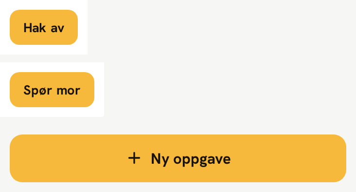

# Rule check: every rule in the guide, against the signed-off picture

The test for [DESIGN-GUIDE.md](DESIGN-GUIDE.md) is not "is this rule sensible" but **"does the
signed-off picture visibly do this"**. A rule the picture does not show is a rule that will drain
the picture, which is exactly what went wrong on ST-729.

Reference: [`reference/poeng-signed-off.png`](reference/poeng-signed-off.png) — five screens,
left to right:

| #   | Screen                     | Frame x (board px) |
| --- | -------------------------- | ------------------ |
| 1   | Familiens hjem             | 88 – 867           |
| 2   | Forelder: oppgaveliste     | 924 – 1703         |
| 3   | Barn: mine oppgaver        | 1760 – 2539        |
| 4   | Barn: haker av en oppgave  | 2596 – 3375        |
| 5   | Barn: poeng og belønninger | 3432 – 4211        |

Crops used as evidence below:
[`meter-evidence.png`](reference/meter-evidence.png) ·
[`screen-4-tick-moment.png`](reference/screen-4-tick-moment.png) ·
[`screen-5-rewards.png`](reference/screen-5-rewards.png) ·
[`row-chore.png`](reference/row-chore.png) ·
[`row-overdue.png`](reference/row-overdue.png)

---

## Revision 4 — what the redraw found (2026-10-09, ST-756)

Revision 3 was checked by reading the reference board. Revision 4 was checked by **building the five
screens and measuring the renders against the board** (ST-740) — which is a stronger test, and it
found ten lines of the guide wrong. Maria approved every correction below. All are in the guide now.

| #   | Guide line in revision 3                       | What the picture measures                                    | Depends on the font? |
| --- | ---------------------------------------------- | ------------------------------------------------------------ | -------------------- |
| 1   | "Display sm 83 px — '215', '225'"              | Two sizes: «215» **83 px**, «225» **59 px** (ratio 0.71)     | no                   |
| 2   | "Display 100 px"                               | **94 px** — «+10» ink is 133 board px, not 137               | no                   |
| 3   | «poeng» beside «+10» — no size given           | **23 px**, display type, ink 60 px wide                      | no                   |
| 4   | "Screen gutter 22 px / 346 px column"          | True on 1, 2, 3, 5; screen 4 is **24 px / 342 px**           | no                   |
| 5   | Bottom nav — no pitch given                    | **92 px pitch**, ≈11 px edge padding; not four quarters      | no                   |
| 6   | Initial badge — absent from the guide          | **38 px circle**, `#ECECE8`, `#15181C` initial, 44 px target | no                   |
| 7   | "Body 20 px"                                   | **16 px** — «Dekke bord» ink is 80.0 px wide                 | **yes**              |
| 8   | "Meta 15 px"                                   | 15 px outside a card; **13 px inside** one                   | **yes**              |
| 9   | "Row action … Body 20 px", "Primary … Body 20" | **16 px** and **16.5 px**                                    | **yes**              |
| 10  | "Label 13 px", "Title 27 px"                   | Both check out — unchanged                                   | —                    |

Items 1–6 are wrong regardless of which face the picture used: they are ratios and geometry inside
the picture. Items 7–9 all point the same way and the likeliest single cause is the one this file
already flags — **the two font names are a guess.** The guide now carries a note that those four
sizes must be re-derived if the real face turns up.

Also recorded in the guide on ST-756: the **two accessibility exceptions** Maria approved — the
"Angre" outline in Ink `#17120A` (the picture's gold is 2.10:1) and the unchecked checkbox outline in
Muted `#555E64` (the picture's `#DFDFD9` is 1.34:1). They are the only two places a build may draw a
colour the picture does not show, and both keep the shape, the width and the surface unchanged.

## Revision 3 — what changed and why (2026-10-07)

Astrid's re-check of revision 2 confirmed every correction in it and found one more token that had
been written rather than measured.

| #   | Finding                                                                  | Status                                                                  |
| --- | ------------------------------------------------------------------------ | ----------------------------------------------------------------------- |
| 1   | `button-row-action` documented at 44 px; every instance is 36 px.        | Confirmed and fixed — 36 px drawn, 44 px padded target.                 |
| 2   | The hit-area line exempted only the chips, implying 44 px row buttons.   | Fixed — the line now names all three sub-44 controls.                   |
| 3   | The font caveat lived only in this file, not in the guide.               | Fixed — the caveat is now a block quote under the two font names.       |
| 4   | "Points meter … spanning the content column" overstates screen 5.        | Fixed — width follows the space given; only height and gap are fixed.   |
| 5   | Row-button and tick-badge radii still unmeasured (found while fixing 1). | Fixed — both measured: 10 px and 16 px. The badge was documented at 18. |

### Finding 1, verified independently

Flood-filled every `#F6B93B` region on all five frames and took the bounding boxes. Five row-action
buttons, none of them 44 px:

| Button     | Screen | Board box                | CSS size    |
| ---------- | ------ | ------------------------ | ----------- |
| "Hak av"   | 3      | x 2328–2467, y 912–983   | 70 × **36** |
| "Hak av"   | 3      | x 2328–2467, y 1146–1217 | 70 × **36** |
| "Spør mor" | 5      | x 3964–4137, y 702–773   | 87 × **36** |
| "Spør mor" | 5      | x 3964–4137, y 902–973   | 87 × **36** |
| "Spør mor" | 5      | x 3964–4137, y 1104–1175 | 87 × **36** |

The same sweep returns 346 × 49 for the primary button on screen 2 and a 166 × 49 ghost interior on
screen 4, both exactly as documented — so the 49 was measured and the 44 was not. The widths differ
between the two labels, which is why the token now carries a height and no width.

### Finding 5, in detail

The radii were the last values in the guide marked "not measured". They are measurable with the same
bounding boxes: walk down the left edge and find the first scanline where the fill reaches the box,
which lands one board px short of the radius. Calibrated against the primary button, where it
returns the 13 px that was measured by hand (first zero at dy = 25 → 26 board px).

| Shape          | First zero | Radius    | Was documented as      |
| -------------- | ---------- | --------- | ---------------------- |
| Primary button | dy = 25    | 13 px     | 13 px ✅ (calibration) |
| Row action     | dy = 19    | **10 px** | 12 px, "not measured"  |
| Tick badge     | dy = 30    | **16 px** | ~18 px, "not measured" |

Both new values are ±1 px and the guide says so.

## Revision 2 — what changed and why (2026-10-07)

Astrid reviewed revision 1 against the picture and found two rules that, followed literally, would
have redrawn parts of it. Re-measuring to confirm them turned up a third, larger problem: the board
scale was wrong, so every CSS px value in revision 1 was off.

| #   | Finding                                                                 | Status                                                        |
| --- | ----------------------------------------------------------------------- | ------------------------------------------------------------- |
| 1   | The family-screen meter was documented as yellow. It is green.          | Confirmed and fixed — two meter components now.               |
| 2   | "The only stroke in the picture" was wrong; a nav divider exists.       | Confirmed and fixed — `hairline` token, three strokes.        |
| 3   | Filter chips are not 44 px tall.                                        | Confirmed and fixed — 33 px, documented with a padded target. |
| 4   | No component entry for the reward card or the "Hentet før" history row. | Fixed — both added.                                           |
| 5   | **Board scale was 2.0, not 1.846** (found while verifying the above).   | Fixed — every size re-measured.                               |

### Finding 5, in detail

Revision 1 read the phone frame as 720 board px wide and derived 1.846 board px per CSS px. The
frame is **780 board px** wide (88–867 on screen 1, and the same width on all five). 780 ÷ 390 =
**exactly 2**, and the frame's content height, 1688 board px, is exactly 2 × 844. The board is five
device-true 390 × 844 screens at `deviceScaleFactor: 2`.

Two consequences:

- Every CSS px value in revision 1 was ~8% too large.
- Revision 1 read screen 1's **three side-by-side child cards** (x 132–349, 368–587, 606–823) as a
  single full-width card spanning 132–823. That is where "screen gutter 8 px" came from. The real
  gutter is 22 px, and the child cards are 109 px wide with 9 px between them.

The type scale was re-derived from scratch rather than rescaled, because the two errors did not
affect every value the same way (Body and Meta came out _larger_, not smaller).

---

All hex values and sizes below were sampled from the PNG, not estimated by eye. Sizes are CSS px at
390 × 844 (2 board px per CSS px).

## Colour rules

| Rule                                                            | Where the picture shows it                                                                                                                                                         |
| --------------------------------------------------------------- | ---------------------------------------------------------------------------------------------------------------------------------------------------------------------------------- |
| One yellow, `#F6B93B`                                           | Sampled identical on screen 2's "Ny oppgave" button, screen 3's meter, screen 4's whole background, screen 5's "Spør mor" buttons. Four different roles, one hex.                  |
| Yellow is a fill colour, not only a surface                     | Screen 2 primary button, screen 3 "Hak av" button and meter segments, screen 5 three reward buttons + two meters — all filled yellow.                                              |
| Yellow is used freely, several times per screen                 | **Screen 5 has five yellow elements.** See [`screen-5-rewards.png`](reference/screen-5-rewards.png).                                                                               |
| **Yellow is not used on the family-screen meters**              | Screen 1, y = 658: Emma `#0F7A54`+`#ECECE8`; Jonas `#0F7A54`+`#ECECE8`+`#A43A16`; Mathea `#0F7A54`+`#ECECE8`. No yellow. See [`meter-evidence.png`](reference/meter-evidence.png). |
| Ink `#17120A` on every yellow surface                           | Screen 4: title, "+10", meter fill, tick badge, "Ferdig" fill — all sampled `#17120A`. 10.57:1.                                                                                    |
| White on yellow never appears                                   | No white type anywhere on screen 4 or on any yellow button. Computed 1.76:1.                                                                                                       |
| Amber Ink `#8A5A00` is a white-background colour                | "5 p" on a white row ([`row-chore.png`](reference/row-chore.png)) and the active nav label. It appears nowhere on the yellow.                                                      |
| Reward costs are Muted Text, not Amber Ink                      | "60 p" on screen 5 sampled `#555E64`, unlike "5 p" on a chore row. Two different points colours, two different meanings.                                                           |
| Overdue Rust `#A43A16`                                          | The word "Forfalt", the 2 px card border, and the overdue meter segment on Jonas's card. See [`row-overdue.png`](reference/row-overdue.png).                                       |
| Done Green `#0F7A54`                                            | Filled check on completed rows (screen 2), "Du har nok poeng" (screen 5), filled chore-meter segments (screen 1).                                                                  |
| Hairline `#DFDFD9`                                              | Nav divider on screens 1, 2, 3, 5; the "Hentet før" divider on screen 5; the unchecked checkbox outline on every chore row. One hex, three uses.                                   |
| Active filter chip is `#15181C`, not Ink                        | Screen 2, chip fill sampled `#15181C` (Text), not `#17120A` (Ink). Revision 1 had this as Ink.                                                                                     |
| Surface `#FFFFFF` on background `#F6F6F4`                       | Every card on screens 1, 2, 3, 5.                                                                                                                                                  |
| On-yellow neutrals are darker shades of the same hue, not greys | Screen 4: inset card `#DBA434`, meter track `#C59430`. No grey appears on the yellow screen.                                                                                       |
| **The Keep-The-Yellow Rule**                                    | The picture never needs it: every text colour in it already clears 4.5:1, and the one hard case (type on yellow) is solved with black at 10.57:1.                                  |
| **The Ink-On-Yellow Rule**                                      | Screen 4, every element.                                                                                                                                                           |
| **The Say-It-In-Words Rule**                                    | "Forfalt" beside the red border; "Gjort 16.10" beside the green tick; "25 igjen" beside the meter; "225 av 250 poeng" on screen 4. No state in the picture is colour-only.         |

## Type rules

Each size was derived as: ink height in board px ÷ 2 ÷ the glyph run's ink-height-per-em, read from
the actual font file (`bricolage800.ttf`, `hanken500/600.ttf`). Measurements were stable across two
luminance thresholds.

| Rule                        | Measured from                    | Ink height   | Em ratio | Derived |
| --------------------------- | -------------------------------- | ------------ | -------- | ------- |
| ~~Display 100 px~~ → 94 px  | "+10", screen 4                  | 137 board px | 0.687    | 99.7 px |
| Display sm 83 px            | "215", screen 3                  | 115 board px | 0.691    | 83.2 px |
| Number 30 px                | "340" on a family card, screen 1 | 41 board px  | 0.687    | 29.8 px |
| Title 27 px                 | "Oppgaver", screen 2             | 46 board px  | 0.859    | 26.8 px |
| ~~Body 20 px~~ → 16 px      | "Dekke bord", screen 2           | 29 board px  | 0.706    | 20.5 px |
| Meta 15 px (outside a card) | "Mathea – kl. 16.30", screen 2   | 22 board px  | 0.716    | 15.4 px |
| Label 13 px                 | "Forfalt" group label, screen 2  | 18 board px  | 0.705    | 12.8 px |
| Caption 12 px               | bottom-nav labels, screen 1      | 22 board px  | 0.925    | 11.9 px |

> **Two rows in this table were re-measured and corrected on ST-756 (2026-10-09).** Drawing the
> screens against the picture (ST-740) and measuring the renders found both:
>
> - **Display is 94 px, not 100.** The 137 board px above included the word «poeng». Isolated,
>   «+10» ink runs x 27.5…170 and is **133 board px** tall; «poeng» runs x 174.5…234.5 and is its
>   own size, **23 px**.
> - **Body is 16 px, not 20.** The ink-height route is unreliable at text sizes — a 1 board px
>   threshold error is 3.5 % of a 29 px measurement. Ink _width_ is not: the picture's «Dekke bord»
>   is **80.0 px** wide, and Hanken Grotesk needs 16 px to reach it, where 20 px renders 100.5 px.
>   The same re-measure splits Meta in two — 15 px outside a card, **13 px inside one** — and puts
>   row-button labels at 16 px and the primary label at 16.5 px.
>
> **Measure text sizes by ink width, and the display sizes by their ratio to «215».** «215» stays
> the 83 px anchor; «225» and «+10» are 0.709 × and 1.137 × its ink, giving 59 and 94. «poeng» came
> from ink width (60 px) like the text sizes. The three ratio-derived sizes are consistent at
> 0.703–0.707 ink height per em, against Bricolage's own 0.687–0.691 — so running them back through
> the font file returns **97, 85 and 60** where the picture's own ratios give **94, 83 and 59**. All
> three are wrong in the same direction by the same ~2 %, which is the signature of the guessed face,
> not of three bad measurements. The guide's numbers are the ratio ones.
>
> **The lever is one measurement:** «215» ink reads 117 board px at ST-740's threshold and 115 at
> revision 3's. 94 is the value that reproduced the picture in a render measured against the board,
> so it stands, but Display, Display xs and Display unit are **±1 px** and the guide says so. Only
> re-measure them from a render, never from a font file — and re-derive all of them if the real
> source face is identified.

| Rule                                                               | Where the picture shows it                                                                                                       |
| ------------------------------------------------------------------ | -------------------------------------------------------------------------------------------------------------------------------- |
| Two faces only: a heavy display grotesque and a humanist text face | No third face, no italic and no uppercase tracking appears anywhere in the five screens. (Which faces exactly — see Unverified.) |
| **The Tabular Numbers Rule**                                       | "215" renders 7.7% wider than proportional figures of the same height would — that extra width is the tabular `1`.               |
| **The One Hero Rule**                                              | Screen 3 has one 83 px number; screen 4 has one 94 px number; screen 5 has one **59 px** number. Never two — but not one size.   |
| Label is _smaller_ than Meta                                       | Group label 13 px vs row meta 15 px, both on screen 2. Counter-intuitive, but that is what the picture does.                     |

## Layout, depth and shape rules

| Rule                                                          | Where the picture shows it                                                                                                                   |
| ------------------------------------------------------------- | -------------------------------------------------------------------------------------------------------------------------------------------- |
| Viewport 390 × 844 at DPR 2                                   | Frame content is 780 × 1688 board px on all five screens (x 88–867 etc., y 194–1881).                                                        |
| Screen gutter 22 px; content column 346 px                    | Screen 2's chore card spans x 969–1658 inside a frame at 924–1703 → 45 board px each side; 690 board px wide.                                |
| **Screen 4 is the exception: 24 px gutter, 342 px column**    | Badge, meter, inset card and both buttons all run x 24–366 in CSS. Corrected on ST-756; the 22 px line held for screens 1, 2, 3, 5 only.     |
| **Bottom nav: 92 px pitch, not four equal quarters**          | Icon ink runs x 47.5–341.5 → 92 px between items, ≈11 px padding at each frame edge. Four quarters of 390 would pitch 97.5. Added on ST-756. |
| **Initial badge: 38 px circle, `#ECECE8`, `#15181C` initial** | Title row y 49–87, right edge on the gutter, on all four light screens. Missing from revision 3 of the guide entirely; added on ST-756.      |
| 8 px between cards                                            | Screen 2 row gaps measured 16 board px (964–979, 1118–1133, 1504–1519).                                                                      |
| Chore row 68 px tall; 15 px padding                           | Screen 2 rows 980–1117, 1134–1269: 136 board px. First ink 27 board px in from the card edge.                                                |
| Family screen: three cards across, 109 px wide, 9 px apart    | Screen 1, y = 620: white at 132–349, 368–587, 606–823, with `#F6F6F4` gaps at 350–367 and 588–605.                                           |
| Primary button 346 × 49 px                                    | Screen 2, "Ny oppgave": x 968–1659, y 1616–1713 → 692 × 98 board px.                                                                         |
| On-yellow buttons 49 px tall                                  | Screen 4, "Angre" and "Ferdig" both y 1744–1841 → 98 board px.                                                                               |
| Row-action buttons 36 px tall; width follows the label        | Five instances, all 72 board px tall: "Hak av" 140 board px wide (screen 3), "Spør mor" 174 (screen 5).                                      |
| Points meter 14 px tall, 4 px gaps                            | Screen 5 y 1308–1335 (28 board px), gaps 8 board px. Screen 4 y 968–995, same.                                                               |
| Chore meter 7 px tall, 3 px gaps                              | Screen 1 y 652–665 (14 board px), gaps 6 board px. **Exactly half the points meter.**                                                        |
| Meter segments divide the width; they are not fixed           | Screen 1: 2 segments at 82 board px. Screen 5: 10 segments at 44–46 board px. Screen 4: 10 segments at 60–62 board px.                       |
| Filter chips 33 px tall, 9 px radius                          | Screen 2, chip band y 430–495 → 66 board px. Corner insets 18, 12, 10, 8 … → R = 18 board px.                                                |
| Checkbox 22 × 22 px, 2 px outline                             | Screen 2, `#DFDFD9` bbox x 996–1039, y 1028–1071 → 44 × 44 board px.                                                                         |
| Tick badge 54 × 54 px                                         | Screen 4, `#17120A` bbox x 2644–2751, y 356–463 → 108 × 108 board px.                                                                        |
| Card radius 12 px, button radius 13 px                        | Card corner insets fit a 24 board px circle; the primary button fits a 26 board px circle.                                                   |
| Row-action radius 10 px, tick-badge radius 16 px              | Corner arcs close at dy = 19 and dy = 30 board px; the same fit returns the primary's measured 13 px.                                        |
| **The Flat Rule** — no shadows                                | The pixel immediately left of every card edge is exactly `#F6F6F4`. There is no gradient, so there is no shadow.                             |
| **The Borders Mean Something Rule** — three strokes           | State: 2 px `#A43A16` overdue border. Control boundary: 2 px `#DFDFD9` checkbox. Divider: 1 px `#DFDFD9`. Nothing else.                      |
| Nav divider: 1 px `#DFDFD9`, full 390 px bleed                | y = 1738–1739 (2 board px), spanning x 88–867 on screen 1 — the **entire** frame width — and the same y on screens 2, 3, 5.                  |
| The yellow screen has no nav and no divider                   | Screen 4 at y 1730–1748 is `#F6B93B` throughout.                                                                                             |
| "Hentet før" divider: 1 px `#DFDFD9`, inset to the column     | Screen 5, y = 1628, x 3476–4167 → 692 board px, exactly the content column.                                                                  |
| Bottom nav sits on the background, not a white bar            | Column samples through the nav band read `#F6F6F4`, not `#FFFFFF`.                                                                           |
| Active nav = colour **and** weight                            | "Hjem" is Amber Ink and heavier; "Oppgaver" is Muted Text.                                                                                   |

## The tick-off moment

| Rule                                          | Where the picture shows it                                                                                                |
| --------------------------------------------- | ------------------------------------------------------------------------------------------------------------------------- |
| The screen is full-bleed yellow               | Screen 4 is `#F6B93B` from y = 264 to the bottom of the frame at y = 1881, edge to edge horizontally. No nav, no divider. |
| …below a 35 px status-bar band                | y 194–263 is `#F6F6F4`. Revision 1 said the yellow ran "behind the status bar"; it does not. Corrected.                   |
| It does not go dark                           | There is no dark surface on screen 4 except the tick badge and the "Ferdig" button.                                       |
| Depth on yellow is a darker shade of yellow   | Inset card `#DBA434` (x 2644–3327), meter track `#C59430`.                                                                |
| Undo is offered plainly, same size as confirm | "Angre" and "Ferdig" are both 98 board px tall, side by side, with "Du kan angre i 5 minutter" above. No confirmshaming.  |

## Rules the picture does **not** support — dropped

| Candidate rule                                       | Why it was not written                                                                                                                        |
| ---------------------------------------------------- | --------------------------------------------------------------------------------------------------------------------------------------------- |
| "Yellow only as a surface" (from the ST-729 guide)   | Contradicted: yellow fills buttons and meters on screens 2, 3 and 5.                                                                          |
| "One yellow area per screen" (from the ST-729 guide) | Contradicted: screen 5 has five.                                                                                                              |
| "The tick moment goes dark" (from the ST-729 guide)  | Contradicted: screen 4 is full-bleed yellow.                                                                                                  |
| "The only stroke is the overdue border" (revision 1) | Contradicted: a `#DFDFD9` divider runs above the nav on all four light screens.                                                               |
| "Meters are yellow" (revision 1)                     | Contradicted: the family-screen chore meters are green, rust and track. Yellow is for points meters only.                                     |
| "Every button is at least 44 px" (revisions 1–2)     | Contradicted: the row-action buttons are 36 px and the filter chips 33 px. Still AA-conformant; both documented with a padded target instead. |
| "Points chips sit on a sunk grey background"         | The picture shows "5 p" as plain amber type on white, no chip background. Sampled `#FFFFFF` behind it.                                        |
| "Overdue rows get a pink fill"                       | The picture shows a **white** fill with a rust border. See [`row-overdue.png`](reference/row-overdue.png).                                    |
| "Primary buttons carry a darker gold border"         | The picture's primary button goes straight from `#F6F6F4` to `#F6B93B` with no border line.                                                   |
| Any dark-mode token set                              | The picture is "lys modus" only. A dark mode is a new sign-off, not a rule.                                                                   |

The last four are differences from the **earlier ST-729 CSS**, not from the picture. The ST-729
sources use `--bg: #EDEFEC`, `--text: #101316`, a pink `--late-bg`, a grey points chip, a bordered
primary button and a `.dark` block "used only by the points moment". The signed-off picture matches
none of those. **Do not treat the ST-729 stylesheet as the token source.**

## Known gaps in the picture

Not faults — just things the five screens do not cover, which therefore are **not** signed off and
must be labelled as additions when they are designed:

- empty, loading, error and offline states;
- settings, auth and onboarding screens;
- any dark mode;
- landscape and tablet widths;
- motion: the picture is still, so no timing or easing is signed off.

## Unverified in this pass

- **Font identity.** Hanken Grotesk and Bricolage Grotesque ship with the earlier Diddit design
  sources and their ink _heights_ fit the picture well, which is how the sizes above were derived.
  Their ink _widths_ do not fit as cleanly: at the derived sizes, "Dekke bord" renders ~8% wider
  than the picture shows and "340" ~5% wider. Negative tracking of about −0.04em would close that
  gap, but so would a slightly narrower face. Revision 1 claimed the faces were "confirmed … within
  ~3%"; that claim does not reproduce at the corrected scale and has been withdrawn. **Treat the
  two faces as the best available match, not as fact**, and confirm against the source HTML if it
  turns up. ~~The derived sizes do not depend on this: ink height is what was measured.~~
  **Withdrawn on ST-756: four of them do.** Button label, Body, Meta and Meta sm are now fitted by
  ink width against Hanken Grotesk and will move if the face changes; the display and Number sizes
  are fitted by ink height and move much less. The ink measurements are the picture's and stand
  either way — the px sizes are what to re-derive. Re-derive them before changing anything else if
  the real face is identified.
- **The size of the initial inside the 38 px badge.** The circle, its fill and its ink colour were
  all measured; a single letter at this scale is too small to size from ink width with confidence.
  The guide carries Meta 15 px as a fit to the circle and flags it as unverified.
- ~~Radii for the row-level action buttons and the tick badge were not measured directly.~~
  Measured in revision 3: 10 px and 16 px, ±1 px, by the corner-arc fit described above.
- **Line heights and letter-spacing** are carried over from revision 1 and were not re-measured;
  only font sizes were.
