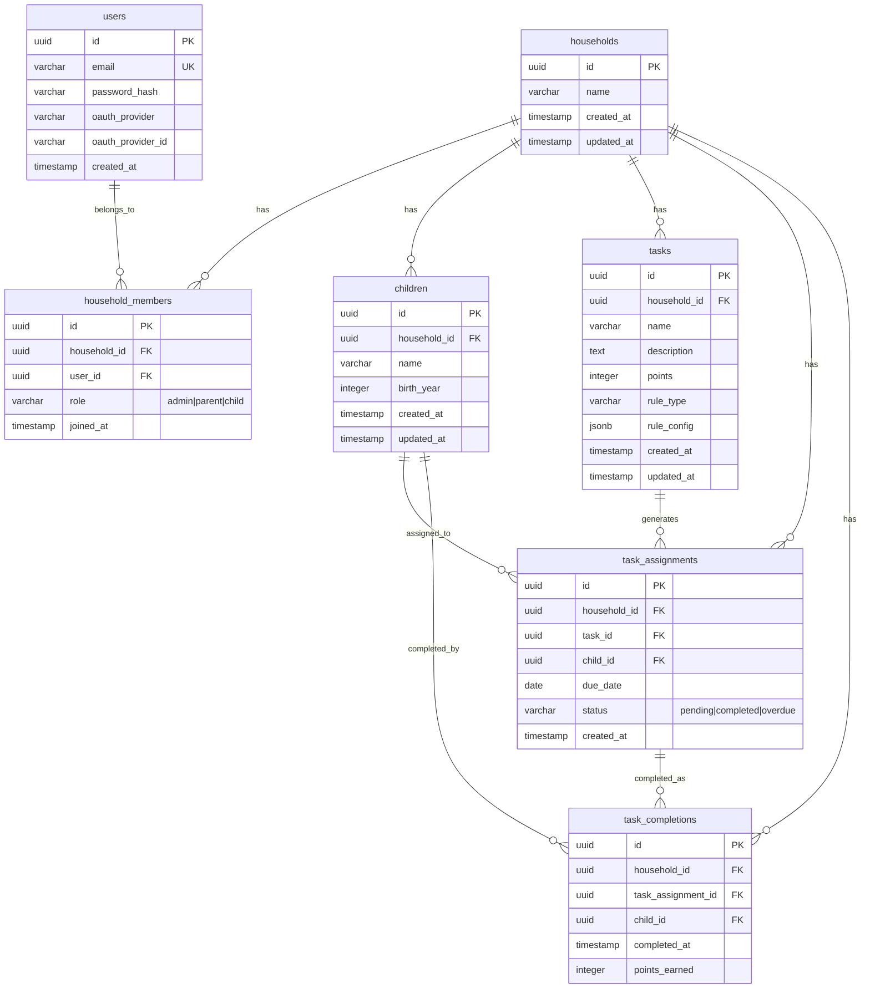

# Task: Document Schema with ERD Diagram

## Metadata
- **ID**: task-019
- **Feature**: feature-002 - Multi-Tenant Database Schema
- **Epic**: epic-001 - Multi-Tenant Foundation
- **Status**: pending
- **Priority**: medium
- **Created**: 2025-12-14
- **Assigned Agent**: orchestrator
- **Estimated Duration**: 2-3 hours

## Description
Create comprehensive schema documentation including an Entity-Relationship Diagram (ERD) that visualizes all tables, relationships, and constraints. Documentation should explain the multi-tenant architecture, data flow, security model, and provide examples for common queries. This serves as the definitive reference for all developers.

## Requirements
- Create ERD diagram showing all tables and relationships
- Document each table's purpose and key columns
- Explain multi-tenant architecture and data isolation
- Provide example queries for common use cases
- Document foreign key constraints and CASCADE behavior
- Document indexes and performance considerations
- Explain Row-Level Security architecture
- Include data dictionary for all columns

## Acceptance Criteria
- [ ] ERD diagram created in Mermaid format (embeddable in Markdown)
- [ ] Schema documentation file created: `docker/postgres/SCHEMA.md`
- [ ] All 6 tables documented with purpose, columns, relationships
- [ ] Multi-tenant architecture explained
- [ ] 10+ example queries documented
- [ ] Foreign key CASCADE behavior documented
- [ ] Index strategy explained
- [ ] RLS policies documented
- [ ] Data dictionary for all columns
- [ ] Quick reference guide for developers

## Dependencies
- All previous tasks (011-018) must be complete
- Schema must be finalized

## Technical Notes

### ERD Diagram (Mermaid)


### Documentation Structure

**SCHEMA.md contents:**
1. **Overview**: Multi-tenant architecture explanation
2. **ERD Diagram**: Visual representation
3. **Tables Reference**: Each table with columns, constraints
4. **Relationships**: Foreign keys and CASCADE behavior
5. **Indexes**: Performance optimization strategy
6. **Security**: Row-Level Security policies
7. **Common Queries**: 10+ examples with explanations
8. **Data Dictionary**: All columns with types, constraints, purpose
9. **Migration History**: List of all migrations
10. **Developer Quick Start**: How to query safely

### Example Queries to Document
```sql
-- 1. Get all households for a user
SELECT h.* FROM households h
JOIN household_members hm ON h.id = hm.household_id
WHERE hm.user_id = '<user-id>';

-- 2. Get children in household
SELECT * FROM children WHERE household_id = '<household-id>';

-- 3. Get pending tasks for child today
SELECT ta.*, t.name, t.description, t.points
FROM task_assignments ta
JOIN tasks t ON ta.task_id = t.id
WHERE ta.child_id = '<child-id>'
AND ta.due_date = CURRENT_DATE
AND ta.status = 'pending';

-- 4. Mark task complete
INSERT INTO task_completions (household_id, task_assignment_id, child_id, points_earned)
VALUES ('<household-id>', '<assignment-id>', '<child-id>', 15);

UPDATE task_assignments SET status = 'completed' WHERE id = '<assignment-id>';

-- 5. Child's total points
SELECT SUM(points_earned) as total_points
FROM task_completions
WHERE child_id = '<child-id>';

-- 6. Weekly completion rate
SELECT 
  COUNT(*) FILTER (WHERE status = 'completed') * 100.0 / COUNT(*) as completion_rate
FROM task_assignments
WHERE household_id = '<household-id>'
AND due_date >= CURRENT_DATE - INTERVAL '7 days';
```

### Data Dictionary Example
| Table | Column | Type | Nullable | Default | Description |
|-------|--------|------|----------|---------|-------------|
| households | id | UUID | NO | gen_random_uuid() | Primary key |
| households | name | VARCHAR(255) | NO | - | Household display name |
| households | created_at | TIMESTAMP | NO | CURRENT_TIMESTAMP | Creation timestamp |

## Affected Areas
- [ ] Frontend (Angular)
- [ ] Backend (Fastify/Node.js)
- [x] Database (PostgreSQL)
- [ ] Infrastructure (Docker/Nginx)
- [ ] CI/CD
- [x] Documentation

## Implementation Plan

### Implementation Steps
1. Create `docker/postgres/SCHEMA.md` file
2. Add ERD diagram in Mermaid format
3. Document each table with purpose and structure
4. Document all foreign key relationships
5. Document CASCADE delete behavior
6. List all indexes with purpose
7. Document RLS policies
8. Add 10+ common query examples
9. Create data dictionary table
10. Add developer quick start section
11. Link from main README.md

### Testing Strategy
- Verify Mermaid diagram renders correctly on GitHub
- Ensure all documented queries are valid SQL
- Test queries against actual database
- Verify all tables and columns documented
- Get peer review from another developer

## Progress Log
- [2025-12-14 00:20] Task created from feature-002 breakdown

## Related Files
- `docker/postgres/SCHEMA.md` - Main documentation (to be created)
- `docker/postgres/migrations/README.md` - Migration documentation
- `README.md` - Link to schema docs

## Acceptance Checklist
- [ ] Mermaid ERD renders correctly
- [ ] All 6 tables documented
- [ ] All foreign keys documented
- [ ] All indexes documented
- [ ] RLS policies explained
- [ ] 10+ query examples
- [ ] Data dictionary complete
- [ ] Linked from README

## Lessons Learned
[To be filled after completion]
